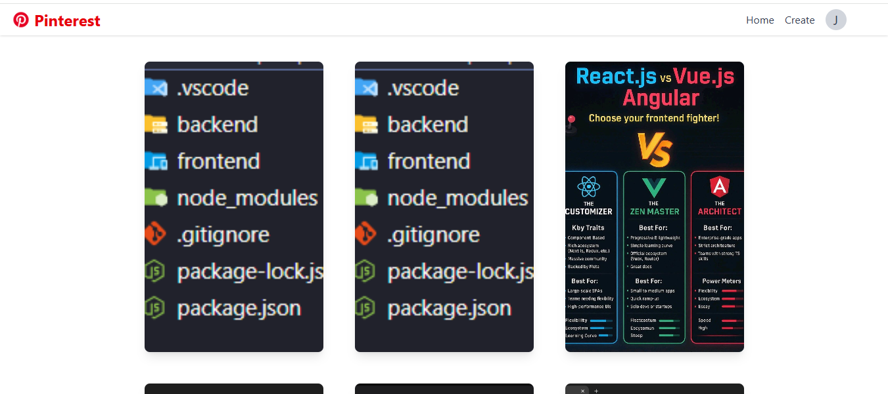
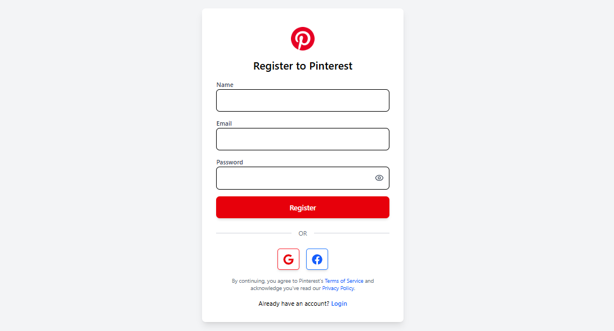
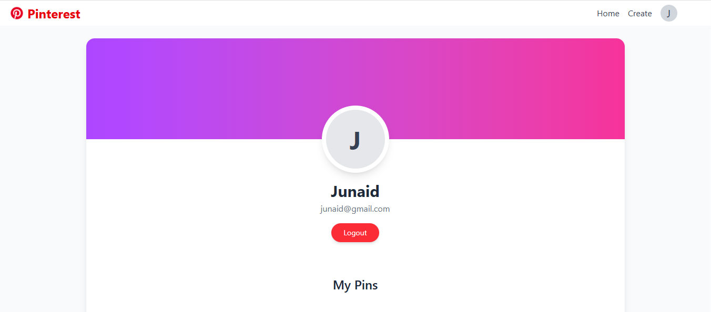
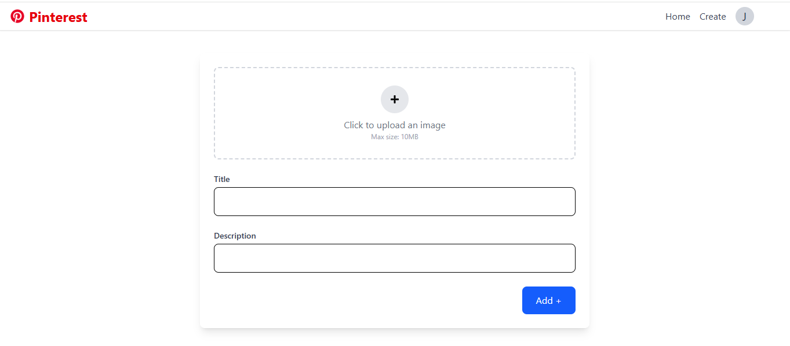
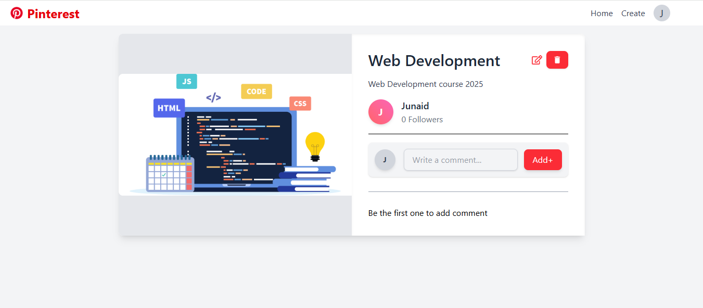

# 📌 Pinterest Clone

A fully responsive, full-stack Pinterest-style web application where users can upload, view, and save pins, manage their profiles, and explore creative content.

Built using React + Vite + Tailwind CSS on the frontend, and Node.js + Express + MongoDB on the backend.

---

## 🌐 Live Demo

🔗 [View Live Project](https://pinterest-c.netlify.app/)

---

## 🛠️ Tech Stack

### 🧩 Frontend
- ⚛️ React 19 (Vite)
- 🎨 Tailwind CSS
- 🔥 React Hot Toast
- 📦 Axios
- 🧭 React Router v7
- 🧠 React Helmet

### 🛠 Backend
- 🌐 Express.js
- 🗄 MongoDB (Mongoose)
- 🛡 CORS, dotenv
- 📫 RESTful APIs

---

## 🚀 Features

- 🔐 User Authentication (Signup/Login)
- 🖼 Upload & Save Pins
- ❤️ Like Pins
- 🔎 Search Pins by Title
- 👤 User Profile Pages
- 🔐 Protected Routes
- 📱 Fully Responsive Design
- 🧠 SEO Optimized
- 🔔 Toast Notifications

---

## 🖼 UI Screenshots

### 🏠 Homepage  


### 🔐 Login Page  


### 📝 Signup Page  


### 👤 User Profile Page  


### 📤 Pin Upload Page  


### 📌 Pin Details Page  


> 📁 Place all screenshots inside the `/screenshots` directory in the root folder.

---


```

pinterest-clone/
├── frontend/          # React Frontend
│   ├── public/
│   ├── src/
│   │   ├── components/
│   │   ├── pages/
│   │   ├── assets/
│   │   └── App.jsx
│   ├── tailwind.config.js
│   └── package.json
│
├── backend/           # Node/Express Backend
│   ├── api/
│   │   ├── routes/
│   │   ├── controllers/
│   │   └── models/
│   ├── .env
│   ├── index.js
│   └── package.json

````

---

## 🧪 Running Locally

### 🔧 1. Clone the Repository

```bash
git clone https://github.com/your-username/pinterest-clone.git
cd pinterest-clone
````

### 🖥 2. Setup Backend

```bash
cd backend
npm install
touch .env
# Add your environment variables in the .env file
npm start
```

### 💻 3. Setup Frontend

```bash
cd frontend
npm install
npm run dev
```

Now visit 👉 `http://localhost:5173` in your browser.

---

## ⚙️ Environment Variables (Backend)

Create a `.env` file in `/backend` directory with the following content:

```env
PORT=5000
MONGO_URI=your_mongo_connection_string
JWT_SECRET=your_jwt_secret
```

---

## 🚢 Deployment

### ✨ Frontend

Deployed on [Vercel](https://vercel.com/)

### ⚙ Backend

Deployed on [Railway](https://railway.app/) or [Render](https://render.com)

---

## 🙋‍♂️ Author

M Waseem
🔗 [GitHub Profile](https://github.com/Waseem3703)
M Waseem
🔗 [Linkedin Profile](https://www.linkedin.com/in/mwaseem3703/)


---

## 📄 License

Free Available for everyone
---

## ⭐ Support

If you found this project helpful, please consider giving it a ⭐ on GitHub and sharing it with your peers!
